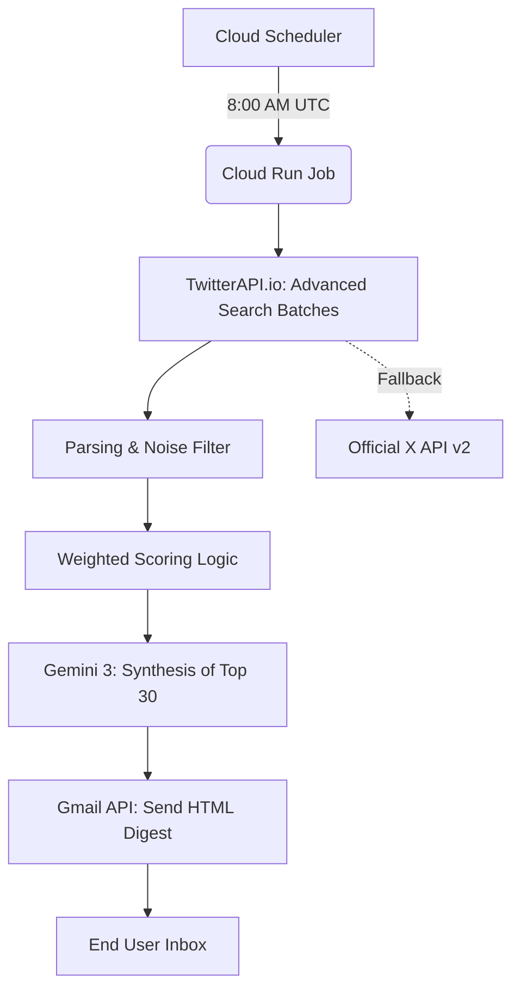

# PRD: Twitter AI Intelligence Brief

## 1. Executive Summary
The **Twitter AI Intelligence Brief** is a standalone, AI-powered information synthesizer designed to bridge the gap between "noisy social media" and "high-density executive intelligence." It automates the process of monitoring top AI thought leaders on X (Twitter), filtering out the noise, and generating a daily, high-quality HTML digest delivered directly to a user's inbox.

---

## 2. Target Audience
- **Startup Founders:** Who need to track AI trends but don't have time to doomscroll.
- **Vibe Coders:** Who use AI tools daily and want to stay updated on new model capabilities and constraints.
- **AI Researchers & Scouts:** Looking for technical observations and industry trajectory signals.

---

## 3. Product Vision & Principles
- **Signal over Noise:** Aggressively filter out retweets, replies, and "threadbois."
- **Depth over Breadth:** Don't just list what happened; explain *how* it works and *why* it matters technical-wise.
- **Zero Friction:** Set it once, receive value daily. Fully automated on Google Cloud.
- **Anti-Laziness AI:** Prevent Gemini "laziness" by strictly limiting input to high-signal data.

---

## 4. Functional Requirements

### 4.1 Data Ingestion (TwitterAPI.io)
- Monitor a configurable list of ~100 top AI thought-leaders.
- Fetch all original tweets from the last 24 hours via Advanced Search queries.
- Optimize costs by batching 10 users per search query.

### 4.2 The "Noise Filter" (Parsing)
- **Discard:** Retweets, replies, and quoted-only tweets (unless they add value).
- **Discard:** Tweets shorter than 30 characters (low-signal).
- **Clean:** Remove URLs (parsed separately), trailing whitespace, and junk characters.

### 4.3 Composite Scoring (The Brain)
- Rank tweets based on a weighted score:
    - **Engagement (50%):** Weighted sum of Likes, Retweets, Replies, and Quotes.
    - **Recency (30%):** Bias towards the most recent updates within the window.
    - **Priority (20%):** Custom weights for specific high-value accounts (configurable).
- Select only the **Top 30** tweets for the final synthesis.

### 4.4 AI Synthesis (Gemini 3 Flash)
- **Multi-Pillar Analysis:** Categorize news into:
    1. 🚀 Tools & Products (Technical Design, Stack)
    2. 📊 Industry Intelligence (Trajectory, Market Shifts)
    3. 🔬 Research & Discoveries (Papers, LLM constraints)
- **Three-Model Fallback:**
    - Primary: `gemini-3-flash-preview`
    - Fallback 1: `gemini-3.1-flash-lite-preview`
    - Fallback 2: `gemini-2.5-flash`

### 4.5 Delivery (Gmail API)
- Transform AI output into a premium, responsive HTML email.
- Send daily at a fixed time (8:00 AM UTC / 1:00 AM PT).

---

## 5. Technical Architecture

| Component | Technology | Role |
| :--- | :--- | :--- |
| **Orchestrator** | Node.js (v20+) | Main pipeline execution logic |
| **Datalake** | TwitterAPI.io | Cost-optimized search data source (~$7/mo) |
| **Logic Engine** | Gemini AI | Semantic analysis and synthesis |
| **Infrastructure** | GCP Cloud Run Job | Cost-efficient, serverless execution |
| **Trigger** | Cloud Scheduler | Cron-based daily triggering |
| **Delivery** | Gmail API | Secure email transport via Google OAuth2 |
| **Fallback** | X API v2 | Reserved for high-reliability emergency fallback |

### Data Flow Diagram (Mermaid)


---

## 6. Development & Operations

### 6.1 Local Setup
- Environment: `.env` file for secrets.
- Auth: `npm run auth` generates a local `google-token.json`.
- Testing: `npm run dry-run` allows for logic tests without sending real emails.

### 6.2 Deployment Strategy
- **Containerization:** Handled by a minimal `Dockerfile`.
- **CI/CD:** Use `gcloud builds submit` for fast image pushing.
- **Config Management:** Use `env-vars-file (yaml)` for deploying secrets to Cloud Run safely.

---

## 7. Configuration Guide
Key environment variables:
- `TWITTER_USERNAMES`: Comma-separated list of accounts.
- `TIMEZONE`: Local timezone (e.g., `America/Los_Angeles`).
- `GOOGLE_TOKEN_JSON`: The authorized Gmail token (passed as a string).
- `GOOGLE_CREDENTIALS_JSON`: The GCP Web App credentials (passed as a string).

---

---

## 9. Operations & GCP Infrastructure Detail

### 9.1 Container Registry
- **Project ID:** `twitter-ai-digest`
- **Region:** `us-west1`
- **Registry Path:** `us-west1-docker.pkg.dev/twitter-ai-digest/twitter-ai-digest-repo/twitter-ai-digest`

### 9.2 Build & Deploy Commands
```bash
# Push new image
gcloud builds submit --tag us-west1-docker.pkg.dev/twitter-ai-digest/twitter-ai-digest-repo/twitter-ai-digest:latest

# Update Job with new Env Vars
gcloud run jobs update twitter-ai-digest \
  --region=us-west1 \
  --env-vars-file=/tmp/env-vars.yaml
```

### 9.3 Cloud Scheduler
- **Job Name:** `twitter-ai-digest-daily`
- **Schedule:** `0 8 * * *` (8:00 AM UTC)
- **Target:** Cloud Run Job Execution

### 9.4 Monitoring Policies
- **Log Metric:** `twitter_digest_errors` (captures `❌` and `ERROR` severity).
- **Alerting Policy:** `Twitter AI Digest - Errors Detected`.
- **Primary Contact:** `hongkimjin@gmail.com`
