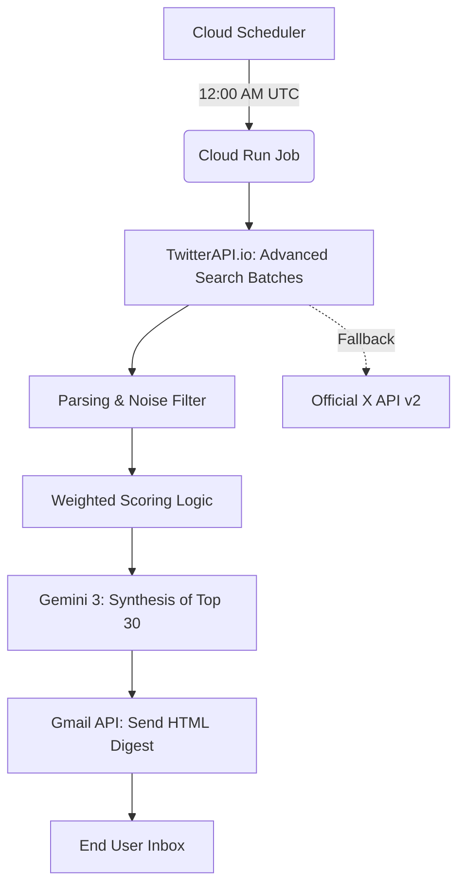

# PRD: Twitter AI Intelligence Brief

## 1. Executive Summary
The **Twitter AI Intelligence Brief** is a standalone, AI-powered information synthesizer designed to bridge the gap between "noisy social media" and "high-density executive intelligence." It automates the process of monitoring top AI thought leaders on X (Twitter), filtering out the noise, and generating a daily, high-quality HTML digest delivered directly to a user's inbox.

---

## 2. Target Audience
- **Startup Founders:** Who need to track AI trends but don't have time to doomscroll.
- **Vibe Coders:** Who use AI tools daily and want to stay updated on new model capabilities and constraints.
- **AI Researchers & Scouts:** Looking for technical observations and industry trajectory signals.

---

## 3. Product Vision & Principles
- **Signal over Noise:** Aggressively filter out retweets, replies, and "threadbois."
- **Depth over Breadth:** Don't just list what happened; explain *how* it works and *why* it matters technical-wise.
- **Zero Friction:** Set it once, receive value daily. Fully automated on Google Cloud.
- **Anti-Laziness AI:** Prevent Gemini "laziness" by strictly limiting input to high-signal data.

---

## 4. Functional Requirements

### 4.1 Data Ingestion (TwitterAPI.io)
- Monitor a configurable list of ~100 top AI thought-leaders.
- Fetch top-engagement original tweets from the last 24 hours via Advanced Search (`query_type: Top`).
- Optimize costs by batching 10 users per search query.

### 4.2 The "Noise Filter" (Parsing)
- **Discard:** Retweets, replies, and quoted-only tweets (unless they add value).
- **Discard:** Tweets shorter than 20 characters (low-signal).
- **Clean:** Remove URLs (parsed separately), trailing whitespace, and junk characters.

### 4.3 Composite Scoring (The Brain)
- Rank tweets based on a weighted score:
    - **Engagement (50%):** Weighted sum of Likes, Retweets, Replies, and Quotes.
    - **Recency (30%):** Bias towards the most recent updates within the window.
    - **Priority (20%):** Custom weights for specific high-value accounts (configurable).
- Select only the **Top 50** tweets for the final synthesis.

### 4.4 AI Synthesis (Gemini 3 Flash)
- **Thesis-First, Middle-Register Prompt:** Each card leads with a bold thesis statement (BLUF format). Language follows a "simplify the grammar, not the ideas" principle — short sentences, concrete subjects, active verbs, precise distinctions.
- **Founder Actionability Filter:** Topics ranked by "Would a founder change a decision this week?"
- **Multi-Pillar Analysis:** Categorize news into:
    1. 🚀 Tools & Products
    2. 📊 Industry Moves
    3. 🔬 Research Worth Knowing
- **Output:** 5-7 cards across pillars. Each card: bold thesis (no labels), 2-3 supporting sentences, linked sources. Preceded by 3 KEY INSIGHTS at the top.
- **Prompt Iteration Tooling:** `ab-test-prompt.js` generates side-by-side prompt variants as real Gmail emails for comparison. See prompt history (versions A-F) documented in that file.
- **Three-Model Fallback:**
    - Primary: `gemini-3-flash-preview`
    - Fallback 1: `gemini-3.1-flash-lite-preview`
    - Fallback 2: `gemini-2.5-flash`

### 4.5 Delivery (Gmail API)
- Transform AI output into a premium, responsive HTML email.
- Send daily at 12:00 AM UTC (midnight), covering the full prior UTC calendar day.

---

## 5. Technical Architecture

| Component | Technology | Role |
| :--- | :--- | :--- |
| **Orchestrator** | Node.js (v20+) | Main pipeline execution logic |
| **Datalake** | TwitterAPI.io | Cost-optimized search data source (~$7/mo) |
| **Logic Engine** | Gemini AI | Semantic analysis and synthesis |
| **Infrastructure** | GCP Cloud Run Job | Cost-efficient, serverless execution |
| **Trigger** | Cloud Scheduler | Cron-based daily triggering |
| **Delivery** | Gmail API | Secure email transport via Google OAuth2 |
| **Fallback** | X API v2 | Reserved for high-reliability emergency fallback |

### Data Flow Diagram (Mermaid)

```mermaid
graph TD
    A[Cloud Scheduler] -->|12:00 AM UTC| B(Cloud Run Job)
    B --> C[TwitterAPI.io: Advanced Search Batches]
    C --> D[Parsing & Noise Filter]
    D --> E[Weighted Scoring Logic]
    E --> F[Gemini 3: Synthesis of Top 30]
    F --> G[Gmail API: Send HTML Digest]
    G --> H[End User Inbox]
    C -.->|Fallback| CA[Official X API v2]
```

---

## 6. Development & Operations

### 6.1 Local Setup
- Environment: `.env` file for secrets.
- Auth: `npm run auth` generates a local `google-token.json`.
- Testing: `npm run dry-run` allows for logic tests without sending real emails.

### 6.2 Deployment Strategy
- **Containerization:** Handled by a minimal `Dockerfile`.
- **CI/CD:** Use `gcloud builds submit` for fast image pushing.
- **Config Management:** Use `env-vars-file (yaml)` for deploying secrets to Cloud Run safely.

---

## 7. Configuration Guide
Key environment variables:
- `TWITTER_USERNAMES`: Comma-separated list of accounts.
- `TIMEZONE`: Local timezone (e.g., `America/Los_Angeles`).
- `GOOGLE_TOKEN_JSON`: The authorized Gmail token (passed as a string).
- `GOOGLE_CREDENTIALS_JSON`: The GCP Web App credentials (passed as a string).

---

---

## 9. Operations & GCP Infrastructure Detail

### 9.1 Container Registry
- **Project ID:** `twitter-ai-digest`
- **Region:** `us-west1`
- **Registry Path:** `us-west1-docker.pkg.dev/twitter-ai-digest/twitter-ai-digest-repo/twitter-ai-digest`

### 9.2 Build & Deploy Commands
```bash
# Build and push new image
gcloud builds submit --tag us-west1-docker.pkg.dev/twitter-ai-digest/twitter-ai-digest-repo/twitter-ai-digest:latest --project=twitter-ai-digest

# Deploy new image to Cloud Run Job
gcloud run jobs update twitter-ai-digest \
  --region=us-west1 \
  --image=us-west1-docker.pkg.dev/twitter-ai-digest/twitter-ai-digest-repo/twitter-ai-digest:latest \
  --project=twitter-ai-digest

# (Optional) Update env vars only — no rebuild needed
gcloud run jobs update twitter-ai-digest \
  --region=us-west1 \
  --env-vars-file=/tmp/env-vars.yaml \
  --project=twitter-ai-digest
```

### 9.3 Cloud Scheduler
- **Job Name:** `twitter-ai-digest-scheduler`
- **Schedule:** `0 0 * * *` (12:00 AM UTC / midnight) — covers the full prior UTC calendar day
- **Target:** Cloud Run Job Execution

### 9.4 Monitoring Policies
- **Log Metric:** `twitter_digest_errors` (captures `❌` and `ERROR` severity).
- **Alerting Policy:** `Twitter AI Digest - Errors Detected`.
- **Primary Contact:** `your-email@example.com`

---

## 10. Backlog

### 10.1 Autonomous Prompt Optimization

**Problem:** Prompt quality degrades silently. The AI may produce dense language, vague insights, or poor pillar balance — and no one notices until a reader complains. Today, improving the prompt requires a human to manually run `ab-test-prompt.js`, read both emails, identify what's wrong, edit the prompt, and re-test. This is slow and infrequent.

**Goal:** The system evaluates its own output against the [Evaluation Framework](EVALUATION_FRAMEWORK.md) after every run, identifies specific weaknesses, and proposes targeted prompt edits — creating a continuous improvement loop that requires human approval but not human diagnosis.

**How it works:**

1. **Score:** After generating the daily digest, a separate Gemini call scores the output against all six evaluation dimensions (Signal Density, Pillar Balance, Source Diversity, Founder Actionability, Freshness & Exclusivity, Noise Floor). Each dimension receives a 1-10 score with a one-sentence justification.
2. **Diagnose:** If any dimension scores below 7, the system generates a specific diagnosis: what went wrong, which part of the prompt caused it, and a proposed edit. Example: "Pillar Balance scored 4/10 — all 6 cards are Tools & Products. The prompt says '1-3 cards per pillar' but doesn't enforce a minimum. Proposed fix: add 'Each pillar MUST have at least 1 card.'"
3. **Propose:** The system writes a candidate prompt diff and generates a test digest using `ab-test-prompt.js`. Both the current and candidate outputs are scored.
4. **Gate:** If the candidate scores higher on the weak dimension without regressing on others, the diff is staged for human review. No prompt changes are applied automatically.

**Persistence:** All scores, diagnoses, and candidate diffs are saved to Firestore under `evaluations/{YYYY-MM-DD}` for trend tracking. A declining score trend across multiple days is a stronger signal than a single bad day.

**Success criteria:**
- Every daily run produces a scored evaluation (stored in Firestore)
- Prompt improvements are proposed automatically when scores drop below threshold
- No prompt change is applied without human approval
- Average evaluation scores trend upward over 30-day windows

**Dependencies:** Evaluation Framework (exists), `ab-test-prompt.js` (exists), Firestore persistence (exists).

---

### 10.2 Weekly & Monthly Synthesis

**Problem:** The daily digest captures what happened today. But founders also need to understand what happened this week and this month — which trends are accelerating, which stories were one-day noise vs. sustained shifts, and how the landscape has changed over time. Currently, there is no way to answer "what were the three biggest AI developments this month?" without manually re-reading 30 daily emails.

**Goal:** Produce weekly (every Sunday) and monthly (1st of each month) synthesis emails that aggregate daily tweet data from Firestore, identify recurring themes and sustained trends, and deliver a higher-altitude briefing that no single daily digest can provide.

**How it works:**

1. **Data source:** Query Firestore `runs/{YYYY-MM-DD}` for the target period (7 or 30 days). Each run document contains the top 50 scored tweets with full text, metrics, author, URL, and scores.
2. **Deduplication:** The same story often appears across multiple days (e.g., a model launch on day 1, reactions on day 2, benchmarks on day 3). The synthesis must merge these into a single narrative arc, not repeat them.
3. **Trend detection:** Identify topics or themes that appeared in 3+ daily digests within the period. These are sustained signals, not noise. Flag topics that appeared once and disappeared — they may be worth noting as "flash" events.
4. **Synthesis:** A dedicated Gemini prompt (different from the daily prompt) produces a structured briefing:
   - **Weekly:** "This Week in AI" — 5-7 stories that mattered, ranked by sustained impact. What changed from Monday to Friday.
   - **Monthly:** "The AI Month" — 3-5 macro themes, each supported by specific events from the month. How the landscape shifted.
5. **Delivery:** Sent as separate emails with distinct subject lines. Weekly on Sunday at 9:00 AM recipient's timezone. Monthly on the 1st.

**Data requirements (see §10.2.1 below):** The current Firestore schema stores enough tweet-level data for re-synthesis. However, the daily generated HTML is not structured for programmatic extraction — the raw tweets are the correct input for weekly/monthly synthesis, not the daily email HTML.

**Success criteria:**
- Weekly email covers 7 days of data, identifies at least 2 sustained trends
- Monthly email covers 30 days, identifies macro shifts vs. one-off events
- No story is repeated verbatim from a daily digest — all content is re-synthesized at a higher altitude
- Delivered on schedule via Cloud Scheduler

**Dependencies:** Firestore daily persistence (exists), Cloud Scheduler (exists), new Gemini prompts (to build), new Cloud Scheduler triggers (to configure).

#### 10.2.1 Data Readiness Assessment

The current Firestore schema at `runs/{YYYY-MM-DD}` stores:
- ✅ `top_tweets[]` with full `text`, `username`, `author_name`, `url`, `metrics`, `score`, `engagement_total` — sufficient for re-synthesis
- ✅ `stats.filtered_tweet_count` and `stats.top_tweet_count` — useful for tracking pipeline health over time
- ✅ `synthesis.model_used` — useful for debugging quality differences

**No schema changes required.** The existing daily persistence captures enough raw signal to power weekly/monthly synthesis. The top-50 tweets per day (up to 350/week, 1500/month) are a manageable input size for Gemini's context window, especially after deduplication.
